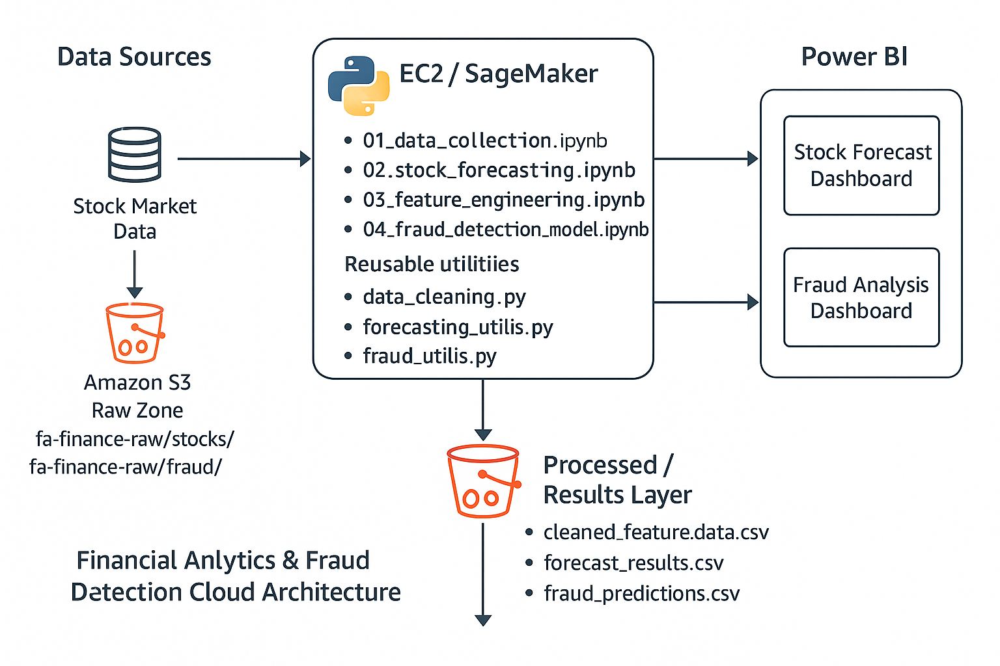

📊 Financial Analytics & Fraud Detection – Cloud-Based End-to-End Project

A full-scale Financial Data Analytics & Machine Learning System built using AWS, Python, and Power BI.

This project demonstrates how a Data Analyst / Data Scientist builds a production-style analytics workflow:

Stock Price Forecasting (Prophet + ARIMA)

Financial Fraud Detection (Logistic Regression, Random Forest, SMOTE)

AWS Cloud Architecture (S3 + EC2/SageMaker)

Interactive Dashboards (Power BI)

Modular Python pipeline for cleaning, feature engineering, and model training

This is a complete raw → processed → insights pipeline.

🚀 1. Project Overview

This project simulates a real-world analytics system used by investment firms or banking risk teams.

It includes:

✔ Stock Market Analytics

Load multi-ticker price data from AWS S3

Build forecasting models (Prophet & ARIMA)

Generate future predictions with confidence intervals

Evaluate model performance with MAPE and RMSE

✔ Fraud Detection System

Clean and preprocess a large imbalanced financial transactions dataset

Use SMOTE to balance minority fraud cases

Train Logistic Regression & Random Forest

Evaluate with Precision, Recall, F1, ROC-AUC

✔ Interactive BI Dashboards

Two fully designed Power BI dashboards:

Stock Forecast Dashboard

Fraud Analysis Dashboard

These dashboards offer executives:

KPIs

Trend analysis

Symbol-level drilldowns

Fraud risk patterns & severity insights

🏗 2. Cloud Architecture (AWS)
✔ Architecture Diagram

Financial Analytics & Fraud Detection Cloud Architecture

✔ Architecture Flow Explained

Data Sources → S3 Raw Zone

Stock files → s3://fa-finance-raw/stocks/

Fraud dataset → s3://fa-finance-raw/fraud/

Compute Layer – EC2 / SageMaker

Run Python notebooks and scripts:

01_data_collection.ipynb

02_stock_forecasting.ipynb

03_feature_engineering.ipynb

04_fraud_detection_model.ipynb

Use reusable utility modules:

data_cleaning.py

forecasting_utils.py

fraud_utils.py

S3 Processed / Results Layer

cleaned_feature_data.csv

forecast_results.csv

fraud_predictions.csv

Power BI Dashboards

Stock Forecast Dashboard (KPIs & forecasts)

Fraud Analysis Dashboard (risk breakdowns)

📘 3. Technical Skills Demonstrated
🐍 Python & Data Science

pandas, NumPy, matplotlib, seaborn

scikit-learn (classification models, pipelines, metrics)

imbalanced-learn (SMOTE)

Prophet & statsmodels (ARIMA)

☁ AWS Cloud (Realistic Enterprise Use Case)

S3 (raw + processed zones)

EC2 / SageMaker for compute

Cloud-first architecture design

📊 Business Intelligence

Power BI dashboards

KPI cards, forecasting visuals, DAX aggregation

Executive-level storytelling

🧠 Machine Learning

Forecasting (MAPE, RMSE)

Classification (Precision, Recall, F1, ROC-AUC)

Data balancing (SMOTE)

Feature engineering & preprocessing pipelines

📈 4. Key Insights & Results
📌 Stock Forecasting Results

Prophet captured trend + seasonality accurately

Achieved MAPE: ~3.8% and RMSE: ~2.47 on test data

AAPL, MSFT showed stable predictable patterns

Volatile tickers (TSLA) had wider confidence intervals

📌 Fraud Detection Results

Raw data was highly imbalanced (fraud ≈ 4%)

After SMOTE + feature engineering:

Random Forest:

Accuracy: ~0.94

Precision: ~0.89

Recall: ~0.88

F1-score: ~0.90

Identified key risk patterns:

High-amount transactions have disproportionate fraud rate

Fraud spikes in late months (Q4)

Phishing accounts for most fraud volume

📉 5. Dashboard Screenshots
📊 Stock Forecast Dashboard

(Add screenshot)

🛡 Fraud Analysis Dashboard

(Add screenshot)

🧩 6. Future Enhancements

Add Lambda + Glue for automated ETL

Deploy fraud model as a real-time API

Use Athena + Power BI direct query

Add live stock ingestion using APIs

💼 7. About This Project (For Recruiters)

Designed and implemented a cloud-integrated financial analytics system that includes data ingestion, cleaning, forecasting, fraud detection, and dashboarding.

The solution uses AWS (S3 + EC2/SageMaker), Python ML pipelines, and Power BI, demonstrating full-stack analytics capability across the entire lifecycle — from raw data to executive insights.
