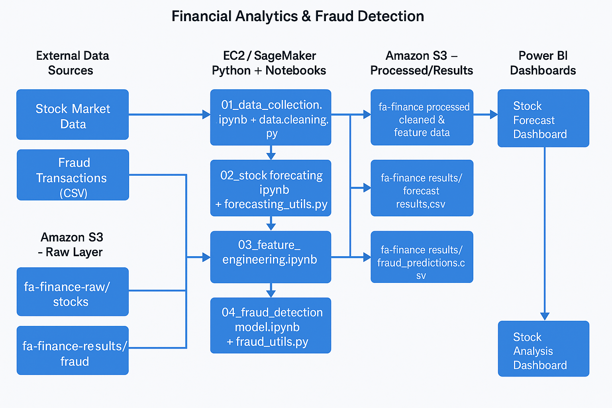
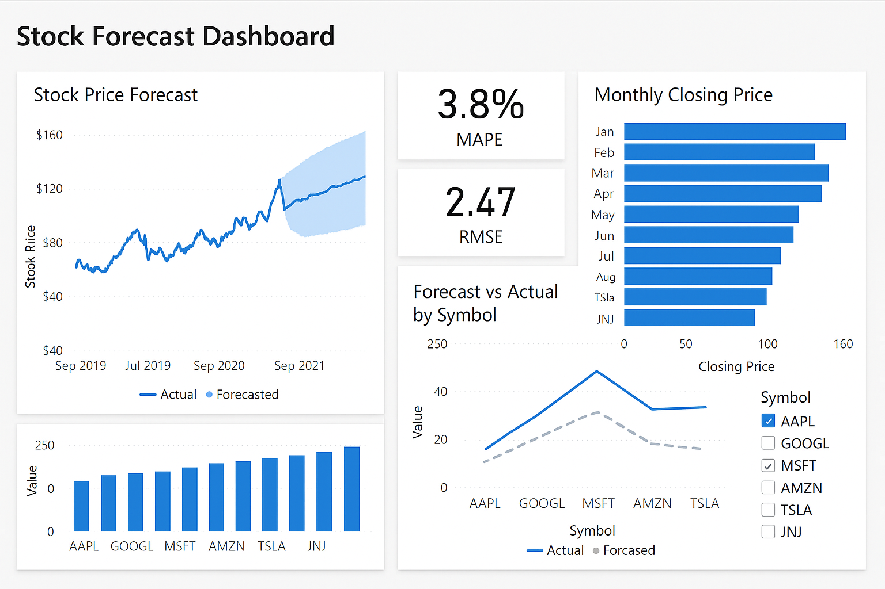
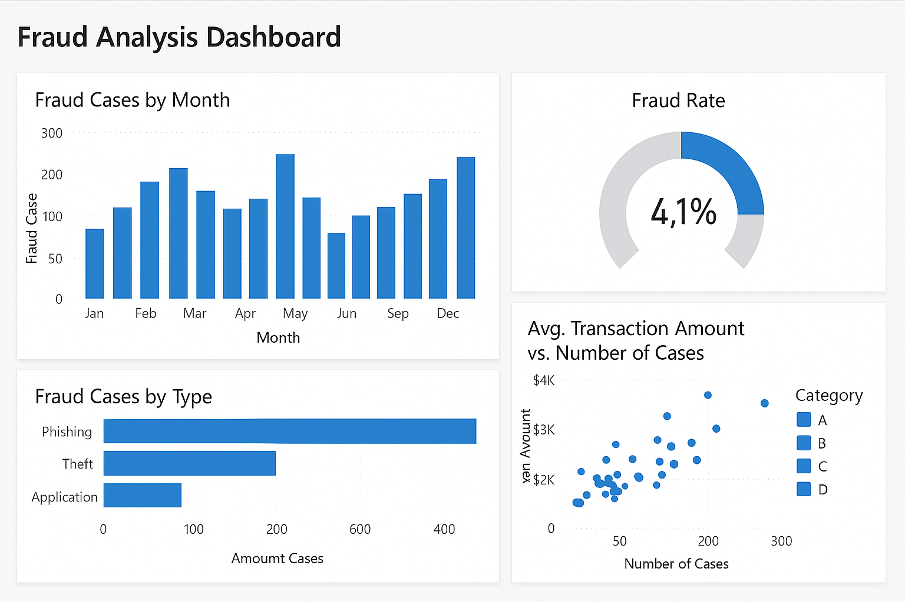

# 📊 Financial Analytics & Fraud Detection – Cloud-Based End-to-End Project

A full-scale Financial Data Analytics & Machine Learning System built using **AWS, Python, and Power BI.**

This project demonstrates how a Data Scientist builds a production-style analytics workflow:

- 📈 **Stock Price Forecasting** (Prophet + ARIMA) — AAPL, MSFT, TSLA, GOOGL, AMZN, JPM
- 🛡 **Financial Fraud Detection** (Logistic Regression, Random Forest, SMOTE)
- ☁ **AWS Cloud Architecture** (S3 + EC2/SageMaker)
- 📊 **Interactive Dashboards** (Power BI)
- 🐍 **Modular Python Pipeline** for cleaning, feature engineering, and model training

This is a complete **raw → processed → insights** pipeline.

---

## 🚀 1. Project Overview

This project simulates a real-world analytics system used by **investment firms and banking risk teams.**

### ✔ Stock Market Analytics
- Load multi-ticker price data (Date, Open, High, Low, Close, Adj Close, Volume) from AWS S3
- Tickers used: **AAPL, MSFT, TSLA, GOOGL, AMZN, JPM**
- JPM (JPMorgan) included specifically to model financial services sector behavior
- Build forecasting models using **Prophet & ARIMA**
- Engineer lag, rolling mean, and volatility features for time-series prediction
- Generate future predictions with confidence intervals
- Evaluate model performance with **MAPE and RMSE**

### ✔ Fraud Detection System
- Clean and preprocess **500K+ imbalanced financial transactions**
- Dataset had ~4% fraud rate — highly imbalanced real-world scenario
- Apply **SMOTE** to balance minority fraud class
- Train **Logistic Regression & Random Forest**
- Evaluate with **Precision, Recall, F1, ROC-AUC**

### ✔ Interactive BI Dashboards
Two fully designed Power BI dashboards:
- 📊 **Stock Forecast Dashboard** — KPIs, trend analysis, symbol-level drilldowns
- 🛡 **Fraud Analysis Dashboard** — fraud risk patterns, severity insights, concentration analysis

---

## 🏗 2. Cloud Architecture (AWS)



### Architecture Flow

```
External Data Sources → S3 Raw Zone → EC2/SageMaker (Python Notebooks)
→ S3 Processed/Results Zone → Power BI Dashboards
```

| Layer | Component | Details |
|---|---|---|
| Raw Data | AWS S3 | s3://fa-finance-raw/stocks/ & s3://fa-finance-raw/fraud/ |
| Compute | EC2 / SageMaker | Python notebooks and modular scripts |
| Processed | AWS S3 | cleaned_feature_data.csv, forecast_results.csv, fraud_predictions.csv |
| Visualization | Power BI | Stock Forecast Dashboard & Fraud Analysis Dashboard |

---

## 📁 3. Project Structure

```
Financial-Analytics-and-Fraud-Detection-Project/
│
├── data/
│   ├── stocks/           # Multi-ticker CSVs (AAPL, MSFT, TSLA, GOOGL, AMZN, JPM)
│   └── fraud/            # Financial transactions dataset (500K+ records)
│
├── notebook/
│   ├── 01_data_collection.ipynb        # Data ingestion from S3 & initial EDA
│   ├── 02_stock_forecasting.ipynb      # ARIMA & Prophet forecasting models
│   ├── 03_feature_engineering.ipynb    # Feature engineering for fraud detection
│   ├── 04_fraud_detection_model.ipynb  # Fraud ML models with SMOTE
│   └── 05_visualizations.ipynb         # Charts & visual exports
│
├── src/
│   ├── data_cleaning.py      # Reusable data cleaning utilities
│   ├── forecasting_utils.py  # ARIMA & Prophet helper functions
│   └── fraud_utils.py        # SMOTE, model training, evaluation functions
│
├── results/
│   ├── forecast_results.csv      # Prophet & ARIMA predictions
│   ├── fraud_predictions.csv     # Model output with fraud scores
│   └── model_comparison.csv      # LR vs RF performance comparison
│
├── sql/                      # SQL queries for data transformation
├── dashboards/               # Power BI dashboard PNGs & PBIX file
└── README.md
```

---

## 📘 4. Technical Skills Demonstrated

### 🐍 Python & Data Science
- pandas, NumPy, matplotlib, seaborn
- scikit-learn (classification models, pipelines, metrics)
- imbalanced-learn (SMOTE)
- Prophet & statsmodels (ARIMA)

### ☁ AWS Cloud
- S3 raw + processed zones
- EC2 / SageMaker for compute and notebook execution
- Cloud-first modular architecture design

### 🧠 Machine Learning
- Time-series forecasting (MAPE, RMSE evaluation)
- Binary classification on imbalanced dataset (SMOTE)
- Precision, Recall, F1-score, ROC-AUC evaluation
- Feature engineering — lag features, rolling mean, volatility

### 📊 Business Intelligence
- Power BI dashboards with KPI cards and DAX measures
- Executive-level storytelling from complex financial data

---

## 📈 5. Key Results

### 📌 Stock Forecasting Results

| Ticker | Model | MAPE | Notes |
|---|---|---|---|
| AAPL | Prophet + ARIMA | ~3.8% | Stable predictable trend |
| MSFT | Prophet + ARIMA | ~3.8% | Strong seasonality captured |
| TSLA | Prophet + ARIMA | Higher | Volatile — wider confidence intervals |
| JPM | Prophet + ARIMA | ~3.8% | Financial sector benchmark |
| GOOGL | Prophet + ARIMA | ~3.8% | Consistent long-term growth pattern |
| AMZN | Prophet + ARIMA | ~3.8% | E-commerce seasonality captured |

- Prophet captured **trend + seasonality** accurately across stable tickers
- TSLA showed **wider confidence intervals** due to high volatility — expected behavior
- JPM included to model **financial services sector** behavior — most relevant to auto lending and credit risk

### 📌 Fraud Detection Results

| Model | Accuracy | Precision | Recall | F1-Score |
|---|---|---|---|---|
| Logistic Regression | Baseline | Baseline | Baseline | Baseline |
| Random Forest + SMOTE | ~0.94 | ~0.89 | ~0.88 | ~0.90 |

- Raw dataset was **highly imbalanced (~4% fraud rate)**
- **SMOTE** applied to generate synthetic minority samples — improved recall to **~88%**
- Evaluated using **ROC-AUC, Precision-Recall curves, F1-score, Confusion Matrix**

### 📌 Key Fraud Risk Patterns Identified
- High-amount transactions have **disproportionate fraud rate**
- Fraud concentration spikes in **Q4 (late months)**
- **Phishing-type** transactions account for highest fraud volume

---

## 📉 6. Dashboard Screenshots

### 📊 Stock Forecast Dashboard


### 🛡 Fraud Analysis Dashboard


---

## 🧩 7. Future Enhancements
- Add **Lambda + Glue** for fully automated serverless ETL
- Deploy fraud model as a **real-time REST API**
- Use **Athena + Power BI direct query** for live dashboard refresh
- Add **live stock ingestion** using Yahoo Finance or Alpha Vantage APIs
- Implement **XGBoost and LightGBM** for improved fraud detection accuracy

---

## 💼 8. About This Project

Designed and implemented a cloud-integrated financial analytics system that includes:
- Multi-ticker stock price **forecasting** using Prophet and ARIMA
- **Fraud detection** on 500K+ imbalanced transactions using ML and SMOTE
- **AWS cloud architecture** with S3 raw/processed zones and EC2/SageMaker compute
- **Power BI dashboards** for executive-level business storytelling

The solution demonstrates full-stack data science capability across the entire lifecycle — from raw financial data to production-ready insights and predictions.

> **Relevance to Financial Services:** The forecasting and fraud detection workflows directly mirror the kind of risk modeling, credit scoring, and automated decision-making used by financial services companies to assess borrower behavior and detect anomalous patterns in lending portfolios.
